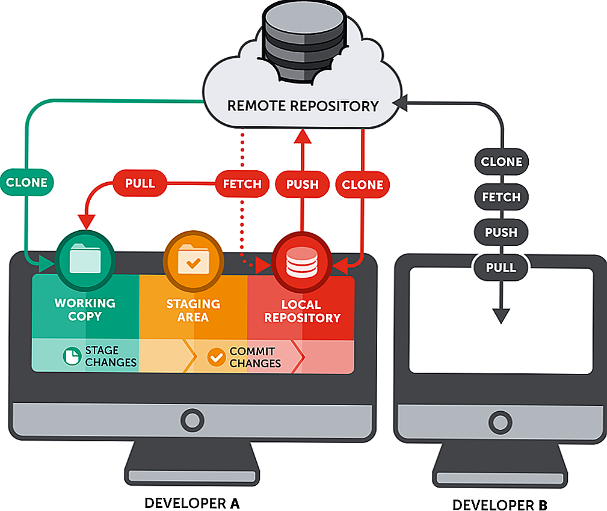

## Локальные и удалённые репозитории.

**"Локальный репозиторий"** находится в рабочей папке во вложенной папке .git вместе с остальными служебными файлами. 

Файлы в папке .git не предназначены для модификации пользователем, их изменение может повлечь неработоспособность системы контроля версий.

> Для создания резервной копии рабочей папки и всех служебных файлов git можно, например, воспользоваться архиватором или просто скопировать всё содержимое рабочей папки в место резервного хранения.

**"Удалённый репозиторий"** находится за пределами персонального компьютера пользователя. Он может находиться в корпоративной локальной сети или в сети Интернет. Часто пользуются публичными сервисами удалённого репозитория (GitHub, GitLab, Bitbucket и т.п.).

Наличие удалённого репозитория предоставляет дополнительные преимущества с точки зрения надёжности хранения и предоставления возможности коллективной работы над проектом. В то-же время использование общедоступных репозиториев предполагает, что размещённая в них информация свободно доступна для ознакомления.

Следует иметь в виду, что использование общедоступного удалённого репозитория означает возможность доступа к размещённой в нём информации всем желающим.

Если хранимая в репозитории информация чувствительна к разглашению следует задуматься о развёртывании собственного приватного репозитория с ограниченным доступом.

[< оглавление](../README.md)

