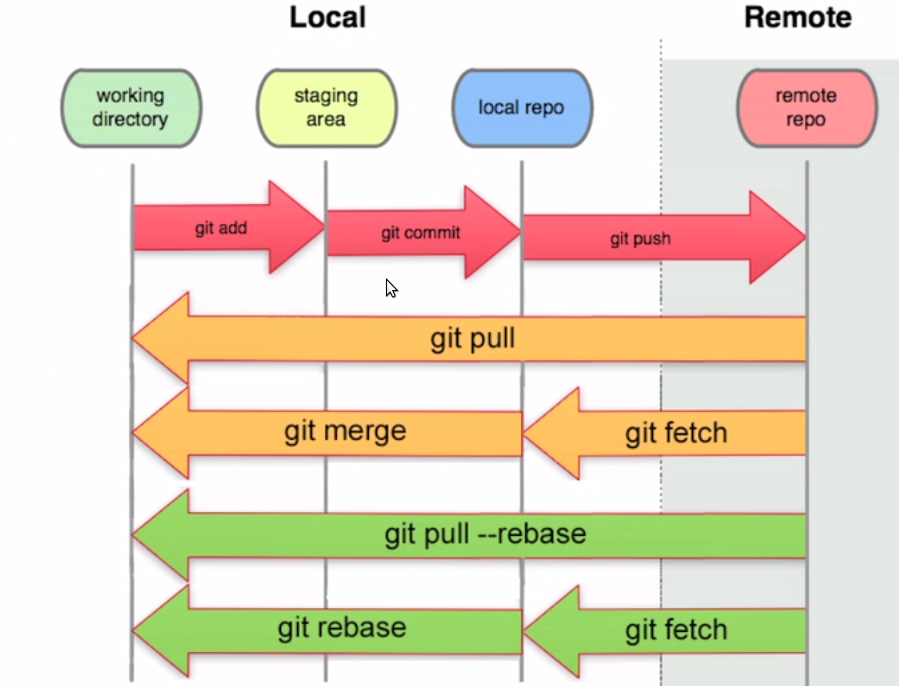

## Рабочая папка. Файлы (и папки). Состояния файлов.

**"Рабочая папка"** это локальная папка на компьютере, в которой пользователь создаёт изменяет или удаляет файлы, относящиеся к предметной области. Обычно папка объединяет файлы, относящиеся к проекту, выделенной задаче или иначе связанные с потребностью пользователя.

Файлы, созданные, изменённые или удалённые в рабочей папке могут находиться в состояниях:

- **untracked**

  Не отслеживаемый. Файл изменён (добавлен, удалён), но не подготовлен для помещения в коммит.

-  **staged**

   Подготовленный. Файл подготовлен для помещения в коммит (проиндексирован)

-  **unmodified**   

    Зафиксированный. Файл добавлен в коммит и в репозиторий, после чего не изменялся.

-  **modified**   

    Изменённый. Файл добавлен в коммит и в репозиторий, после чего был изменён.

Различают области состояний файлов:

1. **Working directory** (Рабочая папка), файлы в состояниях untracked, modified.

2. **Staging area** (Индекс), файлы в состоянии staged.

3. **Local repository** (Локальный репозиторий), файлы в состоянии unmodified.

4. **Remote repository** (Удалённый репозиторий), файлы в состоянии unmodified.

Изменение состояний файлов выполняется командами git.

[< О Г Л А В Л Е Н И Е](../README.md)

